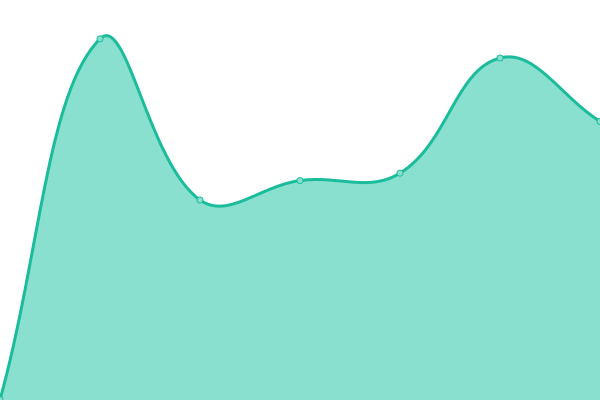
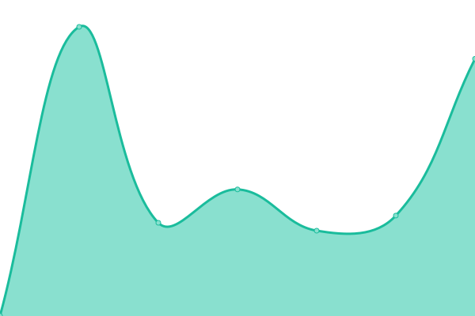
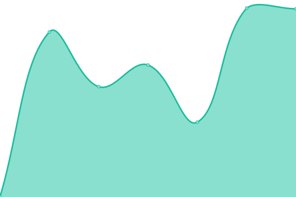
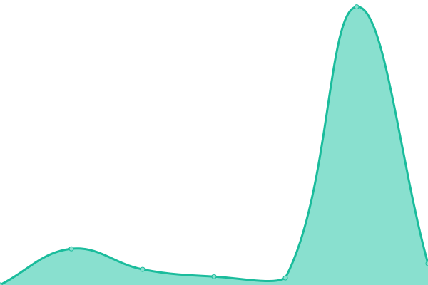

# [📈 Live Status](https://demo.upptime.js.org): <!--live status--> **🟧 Partial outage**

This repository contains the open-source uptime monitor and status page for [Upptime](https://upptime.js.org), powered by [Upptime](https://github.com/upptime/upptime).

With [Upptime](https://upptime.js.org), you can get your own unlimited and free uptime monitor and status page, powered entirely by a GitHub repository. We use [Issues](https://github.com/upptime/upptime/issues) as incident reports, [Actions](https://github.com/upptime/upptime/actions) as uptime monitors, and [Pages](https://demo.upptime.js.org) for the status page.

<!--start: status pages-->
<!-- This summary is generated by Upptime (https://github.com/upptime/upptime) -->
<!-- Do not edit this manually, your changes will be overwritten -->
<!-- prettier-ignore -->
| URL | Status | History | Response Time | Uptime |
| --- | ------ | ------- | ------------- | ------ |
|  [Barrington OPS](https://barringtonops.ca/) | 🟥 Down | [barrington-ops.yml](https://github.com/elebumm/tmrrwstatus/commits/HEAD/history/barrington-ops.yml) | 

 0ms
     
 | 

<a href="https://elebumm.github.io/tmrrwstatus/history/barrington-ops">100.00%</a>
    

|  [tmrrw inc](https://tmrrwinc.ca) | 🟥 Down | [tmrrw-inc.yml](https://github.com/elebumm/tmrrwstatus/commits/HEAD/history/tmrrw-inc.yml) | 

 0ms
     
 | 

<a href="https://elebumm.github.io/tmrrwstatus/history/tmrrw-inc">100.00%</a>
    

|  [ezrealty.ca](https://ezrealty.ca) | 🟩 Up | [ezrealty-ca.yml](https://github.com/elebumm/tmrrwstatus/commits/HEAD/history/ezrealty-ca.yml) | 

 550ms
     
 | 

<a href="https://elebumm.github.io/tmrrwstatus/history/ezrealty-ca">100.00%</a>
    

|  [Carole Cares](https://carolecares.com/) | 🟩 Up | [carole-cares.yml](https://github.com/elebumm/tmrrwstatus/commits/HEAD/history/carole-cares.yml) | 

 1410ms
     
 | 

<a href="https://elebumm.github.io/tmrrwstatus/history/carole-cares">100.00%</a>
    

|  [Corigan WordPress](https://getcorigan.ca/) | 🟩 Up | [corigan-word-press.yml](https://github.com/elebumm/tmrrwstatus/commits/HEAD/history/corigan-word-press.yml) | 

 600ms
     
 | 

<a href="https://elebumm.github.io/tmrrwstatus/history/corigan-word-press">100.00%</a>
    

|  [Downtown Market](https://downtownmarketsarnia.ca/) | 🟩 Up | [downtown-market.yml](https://github.com/elebumm/tmrrwstatus/commits/HEAD/history/downtown-market.yml) | 

 667ms
     
 | 

<a href="https://elebumm.github.io/tmrrwstatus/history/downtown-market">100.00%</a>
    

|  [Sarnia Lambton Chamber](https://slchamber.ca/) | 🟩 Up | [sarnia-lambton-chamber.yml](https://github.com/elebumm/tmrrwstatus/commits/HEAD/history/sarnia-lambton-chamber.yml) | 

 502ms
     
 | 

<a href="https://elebumm.github.io/tmrrwstatus/history/sarnia-lambton-chamber">100.00%</a>
    

|  [Kern Water](https://kernwater.com/) | 🟩 Up | [kern-water.yml](https://github.com/elebumm/tmrrwstatus/commits/HEAD/history/kern-water.yml) | 

 447ms
     
 | 

<a href="https://elebumm.github.io/tmrrwstatus/history/kern-water">100.00%</a>
    

|  [DT Freight](https://dtfreight.ca) | 🟥 Down | [dt-freight.yml](https://github.com/elebumm/tmrrwstatus/commits/HEAD/history/dt-freight.yml) | 

 248ms
     
 | 

<a href="https://elebumm.github.io/tmrrwstatus/history/dt-freight">100.00%</a>
    

|  [GREM](https://grem.ca) | 🟩 Up | [grem.yml](https://github.com/elebumm/tmrrwstatus/commits/HEAD/history/grem.yml) | 

 412ms
     
 | 

<a href="https://elebumm.github.io/tmrrwstatus/history/grem">100.00%</a>
    

|  [Execurooms](https://execurooms.ca/) | 🟩 Up | [execurooms.yml](https://github.com/elebumm/tmrrwstatus/commits/HEAD/history/execurooms.yml) | 

 1382ms
     
 | 

<a href="https://elebumm.github.io/tmrrwstatus/history/execurooms">100.00%</a>
    

|  [Jaime Hayes](https://jaimehayesremax.com/) | 🟩 Up | [jaime-hayes.yml](https://github.com/elebumm/tmrrwstatus/commits/HEAD/history/jaime-hayes.yml) | 

 717ms
     
 | 

<a href="https://elebumm.github.io/tmrrwstatus/history/jaime-hayes">100.00%</a>
    

|  [Noelle's Gift](https://noellesgift.ca/) | 🟩 Up | [noelle-s-gift.yml](https://github.com/elebumm/tmrrwstatus/commits/HEAD/history/noelle-s-gift.yml) | 

 1411ms
     
 | 

<a href="https://elebumm.github.io/tmrrwstatus/history/noelle-s-gift">100.00%</a>
    

|  [Imperial Theatre](https://imperialtheatre.net) | 🟩 Up | [imperial-theatre.yml](https://github.com/elebumm/tmrrwstatus/commits/HEAD/history/imperial-theatre.yml) | 

 716ms
     
 | 

<a href="https://elebumm.github.io/tmrrwstatus/history/imperial-theatre">100.00%</a>
    

|  [Medaesthetics](https://www.medaesthetics.ca) | 🟩 Up | [medaesthetics.yml](https://github.com/elebumm/tmrrwstatus/commits/HEAD/history/medaesthetics.yml) | 

 278ms
     
 | 

<a href="https://elebumm.github.io/tmrrwstatus/history/medaesthetics">100.00%</a>
    

|  [Lambton Bases](https://lambtonbases.ca) | 🟩 Up | [lambton-bases.yml](https://github.com/elebumm/tmrrwstatus/commits/HEAD/history/lambton-bases.yml) | 

 909ms
     
 | 

<a href="https://elebumm.github.io/tmrrwstatus/history/lambton-bases">100.00%</a>
    

<!--end: status pages-->

[**Visit our status website →**](https://demo.upptime.js.org)

## 📄 License

- Powered by: [Upptime](https://github.com/upptime/upptime)
- Code: [MIT](./LICENSE) © [Upptime](https://upptime.js.org)
- Data in the `./history` directory: [Open Database License](https://opendatacommons.org/licenses/odbl/1-0/)
